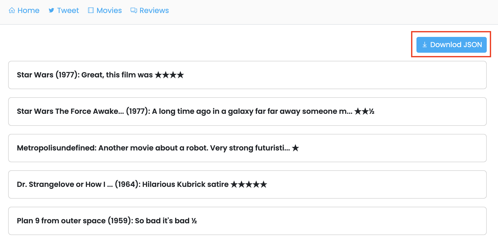
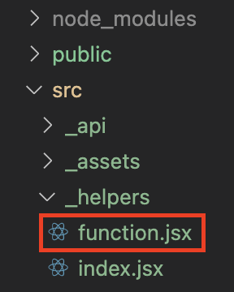

# Getting Started

## View The Project

In the project directory, you can run:

### `yarn start or npm start`

Runs the app in the development mode.\
Open [http://localhost:3000](http://localhost:3000) to view it in your browser.

### `live project`

Open [https://reja-resync.netlify.app](https://reja-resync.netlify.app) to view it live (without local serve)

## Test Case

### `Output`

Open [https://reja-resync.netlify.app](https://reja-resync.netlify.app) or [https://reja-resync.netlify.app/tweet](https://reja-resync.netlify.app/tweet) then click button **"Download JSON"**

### `Function`

The function can be found at root **_"src/\_helpers/function.jsx"_**

